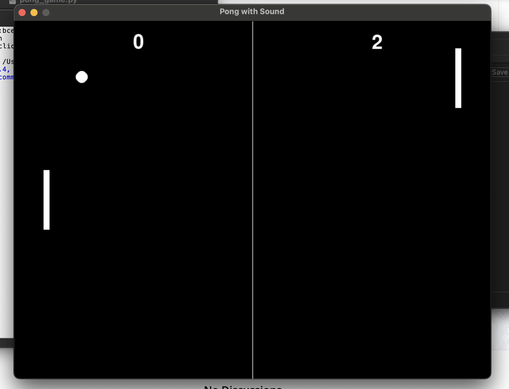

# Pong with Sound
[]()


A simple Pong game built in Python with sound effects.  
Play the classic arcade game with a retro feel, including bounce and score sounds.  



## Features
- Player vs AI Pong gameplay (AI paddle tracks the ball automatically)  
- Ball bounces realistically off paddles and walls  
- Score tracking for both players  
- Sound effects for collisions and points  
- Automatically generates default sound files if missing (custom `.wav` files can be swapped in)  
- Lightweight and easy to run  

## Installation

1. Clone the repository:
   ```bash
   git clone https://github.com/AndreyWinz/pong-sound.git
   cd pong-sound

2. Install dependencies:
   ```bash
   pip install -r requirements.txt
3. Run the game:
   ```bash
   python pong_game.py

## Controls
- Player (Left Paddle):
   - W = Move Up
   - S = Move Down
- AI (Right Paddle):
   - Automatically follows the ball
## Sound Files
- The game uses hit_sound.wav and score_sound.wav.
- If they don’t exist, the program will automatically generate simple beep sounds.
- To customise, replace these .wav files with your own sounds (keep the same filenames).
## License
This project is licensed under the [MIT License](https://github.com/AndreyWinz/pong-sound/blob/main/LICENSE)

## Buy me a Coffee
If you think I deserve a little gift to support me and my creations, feel free to buy me a coffee (not the actual website, but a Revolut payment link)!

Please include your GitHub username in the "Note" section so I can add you to the contributor list on my profile!

[](https://revolut.me/andreygdl9)
